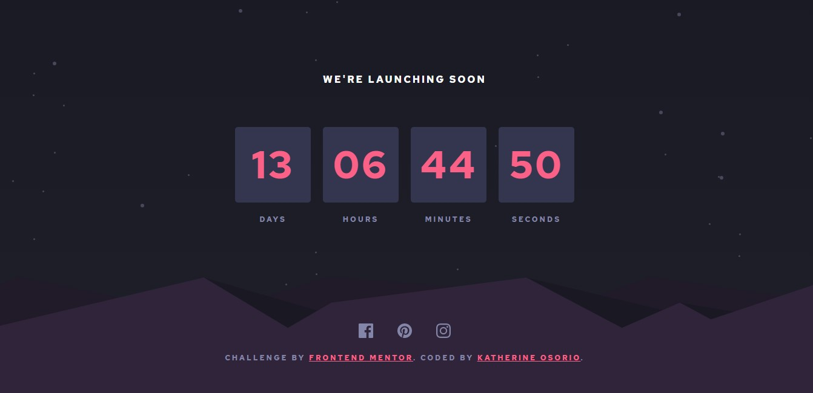
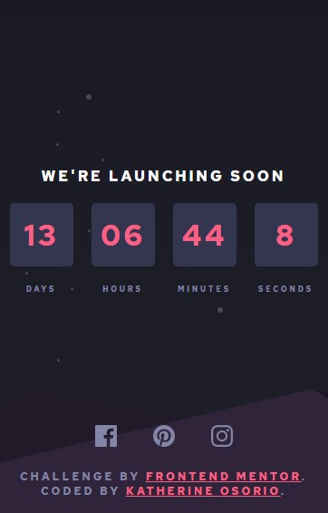

# Frontend Mentor - Launch countdown timer solution

This is a solution to the [Launch countdown timer challenge on Frontend Mentor](https://www.frontendmentor.io/challenges/launch-countdown-timer-N0XkGfyz-). Frontend Mentor challenges help you improve your coding skills by building realistic projects.

## Table of contents

- [Overview](#overview)
  - [The challenge](#the-challenge)
  - [Screenshot](#screenshot)
  - [Links](#links)
- [My process](#my-process)
  - [Built with](#built-with)
  - [What I learned](#what-i-learned)
  - [Continued development](#continued-development)
  - [Useful resources](#useful-resources)
- [Author](#author)

## Overview

### The challenge

Users should be able to:

- See hover states for all interactive elements on the page
- See a live countdown timer that ticks down every second (start the count at 14 days)
- **Bonus**: When a number changes, make the card flip from the middle

### Screenshot

### Links

- Live Site URL: [Add live site URL here](https://countdown-keoty.netlify.app)

## My process

### Built with

- Semantic HTML5 markup
- CSS custom properties
- Flexbox
- CSS Grid
- Mobile-first workflow
- [React](https://reactjs.org/) - JS library

### What I learned

- This project helped me understand how to deploy a react application using netlify, modify the style of svg images and to modify the background images.

### Useful resources

- [Example resource 1](https://dev.to/abachi/how-to-change-svg-s-color-in-react-42g2) - This helped me to change the style of the svg images.
- [Example resource 2](https://levelup.gitconnected.com/how-to-deploy-a-react-app-with-netlify-set-up-continuous-deployment-via-github-53859dcdaf40) - This article explains how to deploy a react app with netlify.

## Author

- Frontend Mentor - [@keoty96](https://www.frontendmentor.io/profile/keoty96)
